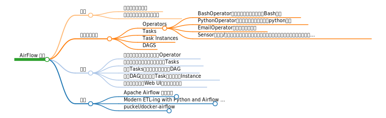

# AirFlow 框架

## 简介
- 一款数据流程工具

Apache-Airflow是Airbnb开源的一款数据流程工具，目前是Apache孵化项目](https://airflow.apache.org/)。以非常灵活的方式来支持数据的ETL过程，同时还支持非常多的插件来完成诸如HDFS监控、邮件通知等功能。
- 支持单机和分布式两种模式  

Airflow支持单机和分布式两种模式，支持Master-Slave模式，支持Mesos等资源调度，有非常好的扩展性。被大量公司采用。

Airflow提供了一系列的python SDK，用户在该SDK的规范下，使用python定义各个ETL节点执行的工作，节点间的关系，同时定义执行计划，失败策略等，提交到Airflow平台中后，平台会根据执行计划自动执行，同时支持失败重试、失败通知等能力。

同时，Airflow还提供了一个Web UI来查看数据流程的执行和支持一部分简单操作。部分功能也可以通过命令行或者Restful API来完成。

## 三个重要概念

### Operators    

Airflow定义的一系列算子/操作符更直接的理解就是python class。不同的Operator类实现了具体的功能，比如：

- BashOperator
  可以执行用户指定的一个Bash命令
- PythonOperator
  可以执行用户指定的一个python函数
- EmailOperator
  可以进行邮件发送
- Sensor
  感知器/触发器，可以定义触发条件和动作，在条件满足时执行某个动作。Airflow提供了更具体的Sensor，比如FileSensor，DatabaseSensor等

### Tasks
Operators的具体实例，在某个Operator的基础上指定了具体的参数或内容。
其实就是OO概念中的对象（Operator是类）

### Task Instances
一个Task的一次运行会产生一个实例

### DAGS
有向无环图，包括一系列的tasks和tasks之间的链接关系

## 使用
使用Airflow的步骤就是定义以上概念的过程：

1. 根据实际需要，使用不同的Operator
2. 传入具体的参数，定义一系列的Tasks
3. 定义Tasks间的关系，形成一个DAG
4. 调度DAG运行，每个Task会行成一个Instance
5. 使用命令行或者Web UI进行查看和管理

## 资料
1. [Apache Airflow 知乎文章](https://zhuanlan.zhihu.com/p/36043468)
2. [Modern ETL-ing with Python and Airflow (and Spark)](https://www.youtube.com/watch?v=tcJhSaowzUI)
3. [puckel/docker-airflow
](https://hub.docker.com/r/puckel/docker-airflow/)
